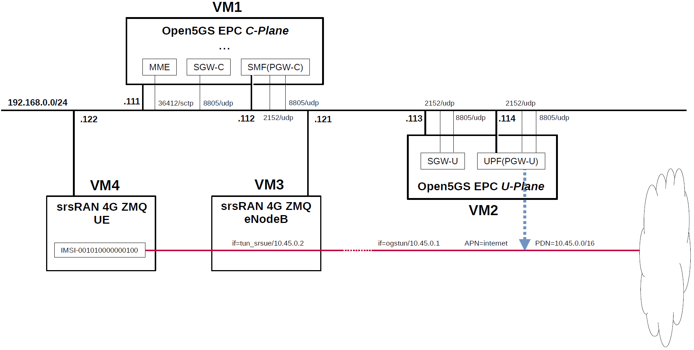

# Open5GS EPC & srsRAN 4G with ZeroMQ UE / RAN Sample Configuration
srsRAN 4G software suite includes a virtual radio which uses the ZeroMQ networking library to transfer radio samples between applications.
Therefore, I used this function to build a simulation environment for the Open5GS CUPS-enabled EPC mobile network.
This configuration is very useful when verifying EPC functionality.
This briefly describes the overall and configuration files.

---

<h2 id="conf_list">List of Sample Configurations</h2>

1. One SGW-C/PGW-C, one SGW-U/PGW-U and one APN (this article)
2. [One SGW-C/PGW-C, Multiple SGW-Us/PGW-Us and APNs](https://github.com/s5uishida/open5gs_epc_oai_sample_config)
3. [One SMF, Multiple UPFs and DNNs](https://github.com/s5uishida/open5gs_5gc_ueransim_sample_config)
4. [Select nearby UPF(PGW-U) according to the connected eNodeB](https://github.com/s5uishida/open5gs_epc_srsran_nearby_upf_sample_config)
5. [Select nearby UPF according to the connected gNodeB](https://github.com/s5uishida/open5gs_5gc_ueransim_nearby_upf_sample_config)
6. [Select UPF based on S-NSSAI](https://github.com/s5uishida/open5gs_5gc_ueransim_snssai_upf_sample_config)
7. [SCP Indirect communication Model C](https://github.com/s5uishida/open5gs_5gc_ueransim_scp_model_c_sample_config)
8. [VoLTE and SMS Configuration for docker_open5gs](https://github.com/s5uishida/docker_open5gs_volte_sms_config)
9. [Monitoring Metrics with Prometheus](https://github.com/s5uishida/open5gs_5gc_ueransim_metrics_sample_config)
10. [Framed Routing](https://github.com/s5uishida/open5gs_5gc_ueransim_framed_routing_sample_config)
11. [VPP-UPF(PGW-U) with DPDK](https://github.com/s5uishida/open5gs_epc_srsran_vpp_upf_dpdk_sample_config)
12. [VPP-UPF with DPDK](https://github.com/s5uishida/open5gs_5gc_ueransim_vpp_upf_dpdk_sample_config)
---

<h2 id="misc">Miscellaneous Notes</h2>

- [Install MongoDB 6.0 and Open5GS WebUI](https://github.com/s5uishida/open5gs_install_mongodb6_webui)
- [Install MongoDB 4.4.18 on Ubuntu 20.04 for Raspberry Pi 4B](https://github.com/s5uishida/install_mongodb_on_ubuntu_for_rp4b)
- [Build srsRAN 4G UE / RAN with ZeroMQ by disabling RF plugins](https://github.com/s5uishida/build_srsran_4g_zmq_disable_rf_plugins)
- [A Note for Changing Network Interface of UPF from TUN to TAP in Open5GS](https://github.com/s5uishida/change_from_tun_to_tap_in_open5gs)
---

<h2 id="toc">Table of Contents</h2>

- [Overview of Open5GS CUPS-enabled EPC Simulation Mobile Network](#overview)
- [Changes in configuration files of Open5GS EPC and srsRAN 4G ZMQ UE / RAN](#changes)
  - [Changes in configuration files of Open5GS EPC C-Plane](#changes_cp)
  - [Changes in configuration files of Open5GS EPC U-Plane](#changes_up)
  - [Changes in configuration files of srsRAN 4G ZMQ UE / RAN](#changes_srs)
    - [Changes in configuration files of RAN](#changes_ran)
    - [Changes in configuration files of UE](#changes_ue)
- [Network settings of Open5GS EPC](#network_settings)
  - [Network settings of Open5GS EPC C-Plane](#network_settings_cp)
  - [Network settings of Open5GS EPC U-Plane](#network_settings_up)
- [Build Open5GS and srsRAN 4G ZMQ UE / RAN](#build)
- [Run Open5GS EPC and srsRAN 4G ZMQ UE / RAN](#run)
  - [Run Open5GS EPC C-Plane](#run_cp)
  - [Run Open5GS EPC U-Plane](#run_up)
  - [Run srsRAN 4G ZMQ RAN](#run_ran)
  - [Run srsRAN 4G ZMQ UE](#run_ue)
- [Ping google.com](#ping)
  - [Case for going through PDN 10.45.0.0/16](#ping_1)
- [Changelog (summary)](#changelog)
---

<h2 id="overview">Overview of Open5GS CUPS-enabled EPC Simulation Mobile Network</h2>

I created a CUPS-enabled EPC mobile network (Internet reachable) for simulation with the aim of creating an environment in which packets can be sent end-to-end with one PDN for one APN.

The following minimum configuration was set as a condition.
- Only one each for C-Plane, U-Plane and UE.

The built simulation environment is as follows.
**According to [this](https://docs.srsran.com/projects/4g/en/latest/app_notes/source/zeromq/source/index.html#known-issues), srsRAN 4G ZMQ supports only one eNodeB and one UE, so I have confirmed the operation with the following configuration.**

</img>

The EPC / UE / RAN used are as follows.
- EPC - Open5GS v2.6.3 (2023.05.02) - https://github.com/open5gs/open5gs
- UE / RAN - srsRAN 4G (2023.05.02) - https://github.com/srsran/srsRAN_4G

Each VMs are as follows.  
| VM # | SW & Role | IP address | OS | Memory (Min) | HDD (Min) |
| --- | --- | --- | --- | --- | --- |
| VM1 | Open5GS EPC C-Plane | 192.168.0.111/24 <br> 192.168.0.112/24 | Ubuntu 22.04 | 1GB | 20GB |
| VM2 | Open5GS EPC U-Plane  | 192.168.0.113/24 <br> 192.168.0.114/24 | Ubuntu 22.04 | 1GB | 20GB |
| VM3 | srsRAN 4G ZMQ RAN (eNodeB) | 192.168.0.121/24 | Ubuntu 22.04 | 2GB | 10GB |
| VM4 | srsRAN 4G ZMQ UE | 192.168.0.122/24 | Ubuntu 22.04 | 2GB | 10GB |

Subscriber Information (other information is the same) is as follows.  
| UE | IMSI | APN | OP/OPc |
| --- | --- | --- | --- |
| UE | 001010000000100 | internet | OPc |

I registered these information with the Open5GS WebUI.
In addition, [3GPP TS 35.208](https://www.3gpp.org/DynaReport/35208.htm) "4.3 Test Sets" is published by 3GPP as test data for the 3GPP authentication and key generation functions (MILENAGE).

PDN is as follows.
| PDN | TUNnel interface of PDN | APN | TUNnel interface of UE |
| --- | --- | --- | --- |
| 10.45.0.0/16 | ogstun | internet | tun_srsue |

The main information of eNodeB is as follows.
| MCC | MNC | TAC | eNodeB ID | Cell ID | E-UTRAN Cell ID |
| --- | --- | --- | --- | --- | --- |
| 001 | 01 | 1 | 0x19b | 0x01 | 0x19b01 |

Additional information.

Open5GS EPC U-Plane worked fine on Raspberry Pi 4 Model B. I used [Ubuntu 20.04 (64bit) for Raspberry Pi 4](https://ubuntu.com/download/raspberry-pi) as the OS. I think it would be convenient to place a compact U-Plane in the edge environment and use it as an end-point for PDN.

In addition, I have not confirmed the communication performance.

<h2 id="changes">Changes in configuration files of Open5GS EPC and srsRAN 4G ZMQ UE / RAN</h2>

Please refer to the following for building Open5GS and srsRAN 4G ZMQ UE / RAN respectively.
- Open5GS v2.6.3 (2023.05.02) - https://open5gs.org/open5gs/docs/guide/02-building-open5gs-from-sources/
- srsRAN 4G (2023.05.02) - https://docs.srsran.com/projects/4g/en/latest/

<h3 id="changes_cp">Changes in configuration files of Open5GS EPC C-Plane</h3>

The following parameters including APN can be used in the logic that selects SGW-U as the connection destination by PFCP.

- APN
- TAC (Tracking Area Code)
- e_CellID

For the sake of simplicity, I used only APN this time. Please refer to [here](https://github.com/open5gs/open5gs/pull/560#issue-483001043) for the logic to select SGW-U.

- `open5gs/install/etc/open5gs/mme.yaml`
```diff
--- mme.yaml.orig       2023-04-30 00:53:19.605284294 +0900
+++ mme.yaml    2023-05-02 12:14:45.353476036 +0900
@@ -321,7 +321,7 @@
 mme:
     freeDiameter: /root/open5gs/install/etc/freeDiameter/mme.conf
     s1ap:
-      - addr: 127.0.0.2
+      - addr: 192.168.0.111
     gtpc:
       - addr: 127.0.0.2
     metrics:
@@ -329,14 +329,14 @@
         port: 9090
     gummei:
       plmn_id:
-        mcc: 999
-        mnc: 70
+        mcc: 001
+        mnc: 01
       mme_gid: 2
       mme_code: 1
     tai:
       plmn_id:
-        mcc: 999
-        mnc: 70
+        mcc: 001
+        mnc: 01
       tac: 1
     security:
         integrity_order : [ EIA2, EIA1, EIA0 ]
```
- `open5gs/install/etc/open5gs/sgwc.yaml`
```diff
--- sgwc.yaml.orig      2023-04-30 00:53:19.632284360 +0900
+++ sgwc.yaml   2023-05-02 12:15:21.450686550 +0900
@@ -81,7 +81,7 @@
     gtpc:
       - addr: 127.0.0.3
     pfcp:
-      - addr: 127.0.0.3
+      - addr: 192.168.0.111
 
 #
 #  <PFCP Client>>
@@ -130,7 +130,8 @@
 #
 sgwu:
     pfcp:
-      - addr: 127.0.0.6
+      - addr: 192.168.0.113
+        apn: internet
 
 #
 #  o Disable use of IPv4 addresses (only IPv6)
```
- `open5gs/install/etc/open5gs/smf.yaml`
```diff
--- smf.yaml.orig       2023-04-30 00:53:19.685284489 +0900
+++ smf.yaml    2023-05-02 12:15:53.714858039 +0900
@@ -598,29 +598,20 @@
 #      maximum_integrity_protected_data_rate_downlink: bitrate64kbs|maximum-UE-rate
 #
 smf:
-    sbi:
-      - addr: 127.0.0.4
-        port: 7777
     pfcp:
-      - addr: 127.0.0.4
-      - addr: ::1
+      - addr: 192.168.0.112
     gtpc:
       - addr: 127.0.0.4
-      - addr: ::1
     gtpu:
-      - addr: 127.0.0.4
-      - addr: ::1
+      - addr: 192.168.0.112
     metrics:
       - addr: 127.0.0.4
         port: 9090
     subnet:
       - addr: 10.45.0.1/16
-      - addr: 2001:db8:cafe::1/48
     dns:
       - 8.8.8.8
       - 8.8.4.4
-      - 2001:4860:4860::8888
-      - 2001:4860:4860::8844
     mtu: 1400
     ctf:
       enabled: auto
@@ -690,10 +681,6 @@
 #          l_linger: 10
 #
 #
-scp:
-    sbi:
-      - addr: 127.0.1.10
-        port: 7777
 
 #
 #  <SBI Client>>
@@ -808,7 +795,8 @@
 #
 upf:
     pfcp:
-      - addr: 127.0.0.7
+      - addr: 192.168.0.114
+        dnn: internet
 
 #
 #  o Disable use of IPv4 addresses (only IPv6)
```

<h3 id="changes_up">Changes in configuration files of Open5GS EPC U-Plane</h3>

- `open5gs/install/etc/open5gs/sgwu.yaml`
```diff
--- sgwu.yaml.orig      2023-04-30 00:53:19.000000000 +0900
+++ sgwu.yaml   2023-04-30 01:13:57.424139141 +0900
@@ -114,9 +114,9 @@
 #
 sgwu:
     pfcp:
-      - addr: 127.0.0.6
+      - addr: 192.168.0.113
     gtpu:
-      - addr: 127.0.0.6
+      - addr: 192.168.0.113
 
 #
 #  <PFCP Client>>
```
- `open5gs/install/etc/open5gs/upf.yaml`
```diff
--- upf.yaml.orig       2023-04-30 00:53:19.000000000 +0900
+++ upf.yaml    2023-05-02 12:18:04.574820474 +0900
@@ -196,12 +196,13 @@
 #
 upf:
     pfcp:
-      - addr: 127.0.0.7
+      - addr: 192.168.0.114
     gtpu:
-      - addr: 127.0.0.7
+      - addr: 192.168.0.114
     subnet:
       - addr: 10.45.0.1/16
-      - addr: 2001:db8:cafe::1/48
+        dnn: internet
+        dev: ogstun
     metrics:
       - addr: 127.0.0.7
         port: 9090
```

<h3 id="changes_srs">Changes in configuration files of srsRAN 4G ZMQ UE / RAN</h3>

<h4 id="changes_ran">Changes in configuration files of RAN</h4>

- `srsRAN_4G/build/srsenb/enb.conf`
```diff
--- enb.conf.example    2023-05-02 10:51:20.239577372 +0900
+++ enb.conf    2023-05-02 11:50:49.433551718 +0900
@@ -22,9 +22,9 @@
 enb_id = 0x19B
 mcc = 001
 mnc = 01
-mme_addr = 127.0.1.100
-gtp_bind_addr = 127.0.1.1
-s1c_bind_addr = 127.0.1.1
+mme_addr = 192.168.0.111
+gtp_bind_addr = 192.168.0.121
+s1c_bind_addr = 192.168.0.121
 s1c_bind_port = 0
 n_prb = 50
 #tm = 4
@@ -80,8 +80,8 @@
 #time_adv_nsamples = auto
 
 # Example for ZMQ-based operation with TCP transport for I/Q samples
-#device_name = zmq
-#device_args = fail_on_disconnect=true,tx_port=tcp://*:2000,rx_port=tcp://localhost:2001,id=enb,base_srate=23.04e6
+device_name = zmq
+device_args = fail_on_disconnect=true,tx_port=tcp://192.168.0.121:2000,rx_port=tcp://192.168.0.122:2001,id=enb,base_srate=23.04e6
 
 #####################################################################
 # Packet capture configuration
```
- `srsRAN_4G/build/srsenb/rr.conf`
```diff
--- rr.conf.example     2023-05-02 10:51:20.245577727 +0900
+++ rr.conf     2023-05-02 11:52:54.050011995 +0900
@@ -55,7 +55,7 @@
   {
     // rf_port = 0;
     cell_id = 0x01;
-    tac = 0x0007;
+    tac = 0x0001;
     pci = 1;
     // root_seq_idx = 204;
     dl_earfcn = 3350;
```

<h4 id="changes_ue">Changes in configuration files of UE</h4>

- `srsRAN_4G/build/srsue/ue.conf`
```diff
--- ue.conf.example     2023-05-02 10:51:20.289580332 +0900
+++ ue.conf     2023-05-02 12:01:28.634519883 +0900
@@ -42,8 +42,8 @@
 #continuous_tx     = auto
 
 # Example for ZMQ-based operation with TCP transport for I/Q samples
-#device_name = zmq
-#device_args = tx_port=tcp://*:2001,rx_port=tcp://localhost:2000,id=ue,base_srate=23.04e6
+device_name = zmq
+device_args = tx_port=tcp://192.168.0.122:2001,rx_port=tcp://192.168.0.121:2000,id=ue,base_srate=23.04e6
 
 #####################################################################
 # EUTRA RAT configuration
@@ -139,9 +139,9 @@
 [usim]
 mode = soft
 algo = milenage
-opc  = 63BFA50EE6523365FF14C1F45F88737D
-k    = 00112233445566778899aabbccddeeff
-imsi = 001010123456780
+opc  = E8ED289DEBA952E4283B54E88E6183CA
+k    = 465B5CE8B199B49FAA5F0A2EE238A6BC
+imsi = 001010000000100
 imei = 353490069873319
 #reader =
 #pin  = 1234
@@ -180,8 +180,8 @@
 #                      Supported: 0 - NULL, 1 - Snow3G, 2 - AES, 3 - ZUC
 #####################################################################
 [nas]
-#apn = internetinternet
-#apn_protocol = ipv4
+apn = internet
+apn_protocol = ipv4
 #user = srsuser
 #pass = srspass
 #force_imsi_attach = false
```

<h2 id="network_settings">Network settings of Open5GS EPC</h2>

<h3 id="network_settings_cp">Network settings of Open5GS EPC C-Plane</h3>

Add IP address for SMF(PGW-C).
```
ip addr add 192.168.0.112/24 dev enp0s8
```
**Note. `enp0s8` is the network interface of `192.168.0.0/24` in my VirtualBox environment.
Please change it according to your environment.**

<h3 id="network_settings_up">Network settings of Open5GS EPC U-Plane</h3>

First, uncomment the next line in the `/etc/sysctl.conf` file and reflect it in the OS.
```
net.ipv4.ip_forward=1
```
```
# sysctl -p
```
Next, add IP address for UPF(PGW-U) and configure the TUNnel interface and NAPT.
```
ip addr add 192.168.0.114/24 dev enp0s8

ip tuntap add name ogstun mode tun
ip addr add 10.45.0.1/16 dev ogstun
ip link set ogstun up

iptables -t nat -A POSTROUTING -s 10.45.0.0/16 ! -o ogstun -j MASQUERADE
```

<h2 id="build">Build Open5GS and srsRAN 4G ZMQ UE / RAN</h2>

Please refer to the following for building Open5GS and srsRAN 4G ZMQ UE / RAN respectively.
- Open5GS v2.6.3 (2023.05.02) - https://open5gs.org/open5gs/docs/guide/02-building-open5gs-from-sources/
- srsRAN 4G (2023.05.02) - https://docs.srsran.com/projects/4g/en/latest/

Install MongoDB on Open5GS EPC C-Plane machine.
It is not necessary to install MongoDB on Open5GS EPC U-Plane machines.
[MongoDB Compass](https://www.mongodb.com/products/compass) is a convenient tool to look at the MongoDB database.
**See also [this](https://github.com/s5uishida/build_srsran_4g_zmq_disable_rf_plugins) for building srsRAN 4G.**

<h2 id="run">Run Open5GS EPC and srsRAN 4G ZMQ UE / RAN</h2>

First run the EPC, then the RAN, and the UE.

<h3 id="run_cp">Run Open5GS EPC C-Plane</h3>

First, run Open5GS EPC C-Plane.

- Open5GS EPC C-Plane
```
./install/bin/open5gs-mmed &
./install/bin/open5gs-sgwcd &
./install/bin/open5gs-smfd &
./install/bin/open5gs-hssd &
./install/bin/open5gs-pcrfd &
```

<h3 id="run_up">Run Open5GS EPC U-Plane</h3>

Next, run Open5GS EPC U-Plane.

- Open5GS EPC U-Plane
```
./install/bin/open5gs-sgwud &
./install/bin/open5gs-upfd &
```

<h3 id="run_ran">Run srsRAN 4G ZMQ RAN</h3>

Run srsRAN 4G ZMQ RAN and connect to Open5GS EPC.
```
# cd srsRAN_4G/build/srsenb
# ./src/srsenb enb.conf
---  Software Radio Systems LTE eNodeB  ---

Reading configuration file enb.conf...

Built in Release mode using commit 655a098b7 on branch master.

Opening 1 channels in RF device=zmq with args=fail_on_disconnect=true,tx_port=tcp://192.168.0.121:2000,rx_port=tcp://192.168.0.122:2001,id=enb,base_srate=23.04e6
Supported RF device list: zmq file
CHx base_srate=23.04e6
CHx id=enb
Current sample rate is 1.92 MHz with a base rate of 23.04 MHz (x12 decimation)
CH0 rx_port=tcp://192.168.0.122:2001
CH0 tx_port=tcp://192.168.0.121:2000
CH0 fail_on_disconnect=true
Current sample rate is 11.52 MHz with a base rate of 23.04 MHz (x2 decimation)
Current sample rate is 11.52 MHz with a base rate of 23.04 MHz (x2 decimation)
Setting frequency: DL=2680.0 Mhz, UL=2560.0 MHz for cc_idx=0 nof_prb=50

==== eNodeB started ===
Type <t> to view trace
```
The Open5GS C-Plane log when executed is as follows.
```
05/02 18:51:30.868: [mme] INFO: eNB-S1 accepted[192.168.0.121]:39366 in s1_path module (../src/mme/s1ap-sctp.c:114)
05/02 18:51:30.868: [mme] INFO: eNB-S1 accepted[192.168.0.121] in master_sm module (../src/mme/mme-sm.c:106)
05/02 18:51:30.868: [mme] INFO: [Added] Number of eNBs is now 1 (../src/mme/mme-context.c:2078)
05/02 18:51:30.868: [mme] INFO: eNB-S1[192.168.0.121] max_num_of_ostreams : 30 (../src/mme/mme-sm.c:148)
```

<h3 id="run_ue">Run srsRAN 4G ZMQ UE</h3>

Run srsRAN 4G ZMQ UE and connect to Open5GS EPC.
```
# cd srsRAN_4G/build/srsue
# ./src/srsue ue.conf
Reading configuration file ue.conf...

Built in Release mode using commit 655a098b7 on branch master.

Opening 1 channels in RF device=zmq with args=tx_port=tcp://192.168.0.122:2001,rx_port=tcp://192.168.0.121:2000,id=ue,base_srate=23.04e6
Supported RF device list: zmq file
CHx base_srate=23.04e6
CHx id=ue
Current sample rate is 1.92 MHz with a base rate of 23.04 MHz (x12 decimation)
CH0 rx_port=tcp://192.168.0.121:2000
CH0 tx_port=tcp://192.168.0.122:2001
Waiting PHY to initialize ... done!
Attaching UE...
Current sample rate is 1.92 MHz with a base rate of 23.04 MHz (x12 decimation)
Current sample rate is 1.92 MHz with a base rate of 23.04 MHz (x12 decimation)
.
Found Cell:  Mode=FDD, PCI=1, PRB=50, Ports=1, CP=Normal, CFO=-0.2 KHz
Current sample rate is 11.52 MHz with a base rate of 23.04 MHz (x2 decimation)
Current sample rate is 11.52 MHz with a base rate of 23.04 MHz (x2 decimation)
Found PLMN:  Id=00101, TAC=1
Random Access Transmission: seq=45, tti=341, ra-rnti=0x2
RRC Connected
Random Access Complete.     c-rnti=0x46, ta=0
Network attach successful. IP: 10.45.0.2
 nTp) 2/5/2023 10:1:7 TZ:99
```
The Open5GS C-Plane log when executed is as follows.
```
05/02 19:01:07.186: [mme] INFO: InitialUEMessage (../src/mme/s1ap-handler.c:232)
05/02 19:01:07.186: [mme] INFO: [Added] Number of eNB-UEs is now 1 (../src/mme/mme-context.c:3911)
05/02 19:01:07.186: [mme] INFO: Unknown UE by S_TMSI[G:2,C:1,M_TMSI:0xc0000078] (../src/mme/s1ap-handler.c:301)
05/02 19:01:07.186: [mme] INFO:     ENB_UE_S1AP_ID[1] MME_UE_S1AP_ID[1] TAC[1] CellID[0x19b01] (../src/mme/s1ap-handler.c:387)
05/02 19:01:07.189: [mme] INFO: Unknown UE by GUTI[G:2,C:1,M_TMSI:0xc0000078] (../src/mme/mme-context.c:2801)
05/02 19:01:07.189: [mme] INFO: [Added] Number of MME-UEs is now 1 (../src/mme/mme-context.c:2610)
05/02 19:01:07.189: [emm] INFO: [] Attach request (../src/mme/emm-sm.c:364)
05/02 19:01:07.191: [emm] INFO:     GUTI[G:2,C:1,M_TMSI:0xc0000078] IMSI[Unknown IMSI] (../src/mme/emm-handler.c:238)
05/02 19:01:07.281: [emm] INFO: Identity response (../src/mme/emm-sm.c:334)
05/02 19:01:07.282: [emm] INFO:     IMSI[001010000000100] (../src/mme/emm-handler.c:401)
05/02 19:01:07.429: [mme] INFO: [Added] Number of MME-Sessions is now 1 (../src/mme/mme-context.c:3925)
05/02 19:01:07.475: [sgwc] INFO: [Added] Number of SGWC-UEs is now 1 (../src/sgwc/context.c:237)
05/02 19:01:07.475: [sgwc] INFO: [Added] Number of SGWC-Sessions is now 1 (../src/sgwc/context.c:879)
05/02 19:01:07.476: [sgwc] INFO: UE IMSI[001010000000100] APN[internet] (../src/sgwc/s11-handler.c:237)
05/02 19:01:07.477: [gtp] INFO: gtp_connect() [127.0.0.4]:2123 (../lib/gtp/path.c:60)
05/02 19:01:07.477: [smf] INFO: [Added] Number of SMF-UEs is now 1 (../src/smf/context.c:1010)
05/02 19:01:07.477: [smf] INFO: [Added] Number of SMF-Sessions is now 1 (../src/smf/context.c:3051)
05/02 19:01:07.477: [smf] INFO: UE IMSI[001010000000100] APN[internet] IPv4[10.45.0.2] IPv6[] (../src/smf/s5c-handler.c:255)
05/02 19:01:07.481: [gtp] INFO: gtp_connect() [192.168.0.114]:2152 (../lib/gtp/path.c:60)
05/02 19:01:07.482: [gtp] INFO: gtp_connect() [127.0.0.4]:2123 (../lib/gtp/path.c:60)
05/02 19:01:07.822: [emm] INFO: [001010000000100] Attach complete (../src/mme/emm-sm.c:1249)
05/02 19:01:07.822: [emm] INFO:     IMSI[001010000000100] (../src/mme/emm-handler.c:276)
05/02 19:01:07.823: [emm] INFO:     UTC [2023-05-02T10:01:07] Timezone[0]/DST[0] (../src/mme/emm-handler.c:282)
05/02 19:01:07.823: [emm] INFO:     LOCAL [2023-05-02T19:01:07] Timezone[32400]/DST[0] (../src/mme/emm-handler.c:286)
```
The Open5GS U-Plane log when executed is as follows.
```
05/02 19:01:07.460: [sgwu] INFO: UE F-SEID[UP:0x56e CP:0xa32] (../src/sgwu/context.c:169)
05/02 19:01:07.460: [sgwu] INFO: [Added] Number of SGWU-Sessions is now 1 (../src/sgwu/context.c:174)
05/02 19:01:07.465: [upf] INFO: [Added] Number of UPF-Sessions is now 1 (../src/upf/context.c:206)
05/02 19:01:07.465: [gtp] INFO: gtp_connect() [192.168.0.113]:2152 (../lib/gtp/path.c:60)
05/02 19:01:07.465: [gtp] INFO: gtp_connect() [192.168.0.112]:2152 (../lib/gtp/path.c:60)
05/02 19:01:07.465: [upf] INFO: UE F-SEID[UP:0xd62 CP:0xb57] APN[internet] PDN-Type[1] IPv4[10.45.0.2] IPv6[] (../src/upf/context.c:483)
05/02 19:01:07.465: [upf] INFO: UE F-SEID[UP:0xd62 CP:0xb57] APN[internet] PDN-Type[1] IPv4[10.45.0.2] IPv6[] (../src/upf/context.c:483)
05/02 19:01:07.467: [gtp] INFO: gtp_connect() [192.168.0.114]:2152 (../lib/gtp/path.c:60)
05/02 19:01:07.808: [gtp] INFO: gtp_connect() [192.168.0.121]:2152 (../lib/gtp/path.c:60)
```
The result of `ip addr show` on VM4 (UE) is as follows.
```
# ip addr show
...
4: tun_srsue: <POINTOPOINT,MULTICAST,NOARP,UP,LOWER_UP> mtu 1500 qdisc fq_codel state UNKNOWN group default qlen 500
    link/none 
    inet 10.45.0.2/24 scope global tun_srsue
       valid_lft forever preferred_lft forever
...
```

<h2 id="ping">Ping google.com</h2>

Specify the TUN interface on VM4 (UE) and try `ping`.

<h3 id="ping_1">Case for going through PDN 10.45.0.0/16</h3>

Execute `tcpdump` on VM2 (U-Plane) and check that the packet goes through `if=ogstun`.
- `ping google.com` on VM4 (UE)
```
# ping google.com -I tun_srsue -n
PING google.com (142.250.196.142) from 10.45.0.2 tun_srsue: 56(84) bytes of data.
64 bytes from 142.250.196.142: icmp_seq=1 ttl=61 time=84.7 ms
64 bytes from 142.250.196.142: icmp_seq=2 ttl=61 time=99.1 ms
64 bytes from 142.250.196.142: icmp_seq=3 ttl=61 time=66.2 ms
```
- Run `tcpdump` on VM2 (U-Plane)
```
# tcpdump -i ogstun -n
tcpdump: verbose output suppressed, use -v[v]... for full protocol decode
listening on ogstun, link-type RAW (Raw IP), snapshot length 262144 bytes
19:11:45.957799 IP 10.45.0.2 > 142.250.196.142: ICMP echo request, id 5, seq 1, length 64
19:11:45.975994 IP 142.250.196.142 > 10.45.0.2: ICMP echo reply, id 5, seq 1, length 64
19:11:46.976432 IP 10.45.0.2 > 142.250.196.142: ICMP echo request, id 5, seq 2, length 64
19:11:46.993369 IP 142.250.196.142 > 10.45.0.2: ICMP echo reply, id 5, seq 2, length 64
19:11:47.944754 IP 10.45.0.2 > 142.250.196.142: ICMP echo request, id 5, seq 3, length 64
19:11:47.962032 IP 142.250.196.142 > 10.45.0.2: ICMP echo reply, id 5, seq 3, length 64
```
You could now create the end-to-end TUN interface on the PDN and send any packets on the network.

---
In investigating private LTE, I have built a simulation environment and can now use a very useful system for investigating CUPS-enabled EPC and MEC of LTE mobile network. I would like to thank the excellent developers and all the contributors of Open5GS and srsRAN 4G.

<h2 id="changelog">Changelog (summary)</h2>

- [2023.05.02] Initial release.
